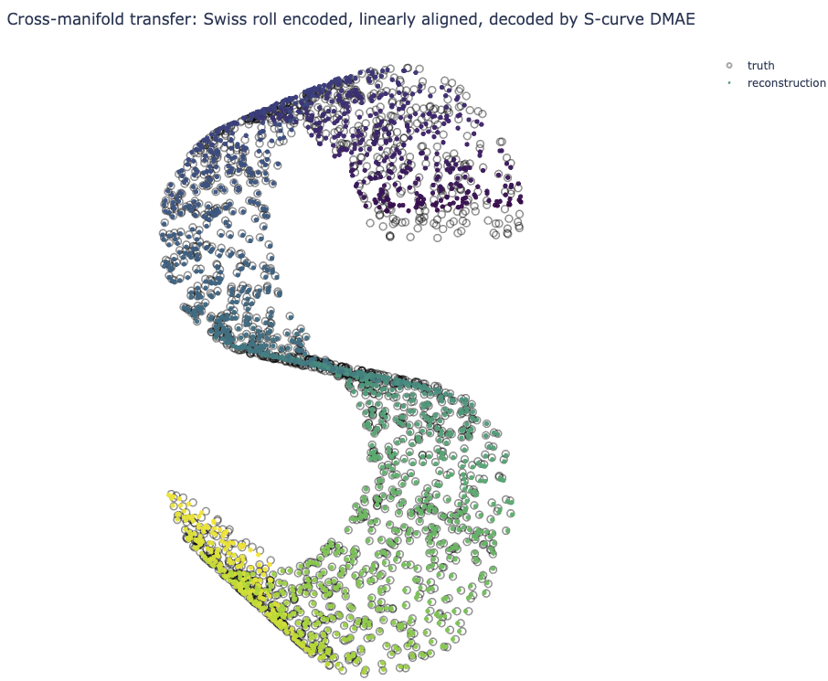

# DMAE : Diffusion Map Autoencoder

[](https://arxiv.org/abs/2409.05901)

This work presents a geometric autoencoder for manifold-like datasets.





## Citation

```
@article{candanedo2024dmae,
  title={Diffusion Map Autoencoder},
  author={Candanedo, Julio},
  journal={preprint \href{https://arxiv.org/abs/2409.05901}{arXiv:2505.10465}},
  year={2024}
}
```
